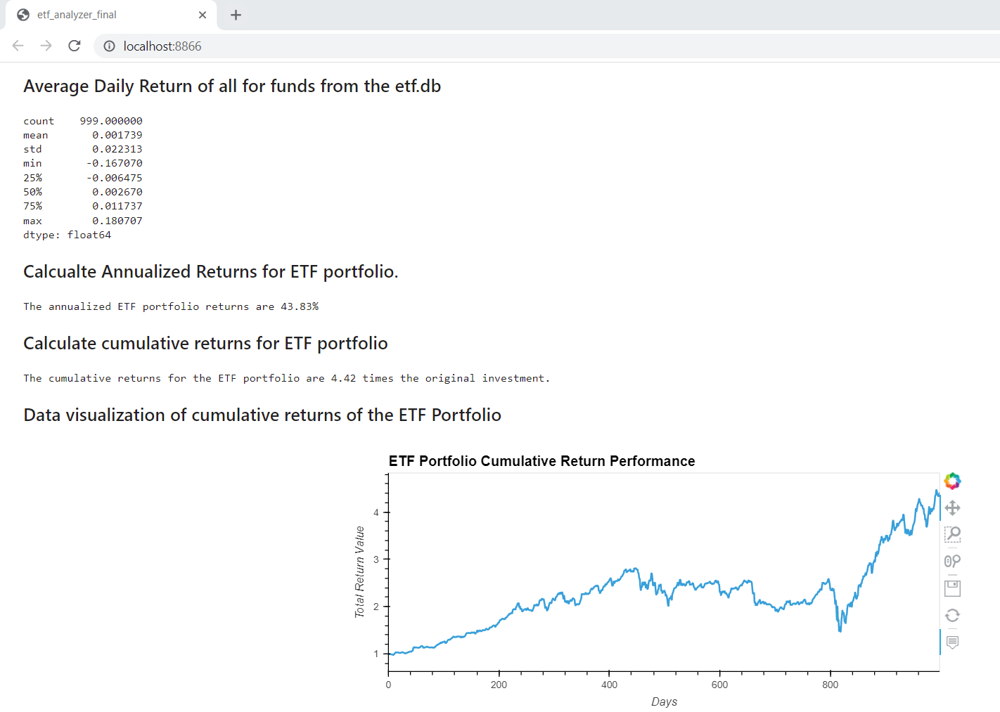

# ETF-Analysis-App
UW Fintech Module 7 Challenge

---

## Technologies

The following libraries are used in this analysis:  
  
  * pandas  
  * numpy
  * hvplot
  * sqlalchemy  
  * voila
  
---

## Purpose of Program

We have been tasked with extracting data from an existing ETF Porfolio database (etf.db), via queries to then conduct analysis on the relevant data to demonstrate an ability to extract data via SQL, convert to a dataframe, and present analysis via pandas and hvplot.  
  
To skills demonstrated include:  
  
  * query tables in database  
  * read tables from database
  * convert query to DataFrame
  * plot data extracted from table (daily returns)
  * calculate cumulative returns
  * filter queries
  * combined multiple tables into a single DataFrame
  * create web page of results via voila

---

## Conclusions

Through this exercise, I have discovered the power of SQL as the logic for pulling data is more straightforward than pandas or some of the other libraries we have used in the past.  For example, instead of creating each table as a Dataframe and concatenating the files, we can query the tables and join that query as demonstrated below:  
 
 
 
 
In regards to data analysis, we are able to conlcude that the ETF Portfolio we analyzed had annualized returns of 42.83%, and the cumulative return over the timeframe was 4.42 times the original value as the below screencapture from Voila shows:
  
  
  
Finally, we demonstrated our ability to use voila to create web pages out of the Jupyter Notebook.  As an example we ran voila on the web_app notebook, and that screen capture is below:
  
  

---

## Contributors

The majority of this project has been done independently, with support from my tutor, Katy Kirby

---

## License

Program is free to use without license.  Only request is that you notify author of use and application.
  
To discuss usage or general inquires please contact the author at jonm5214@gmail.com
